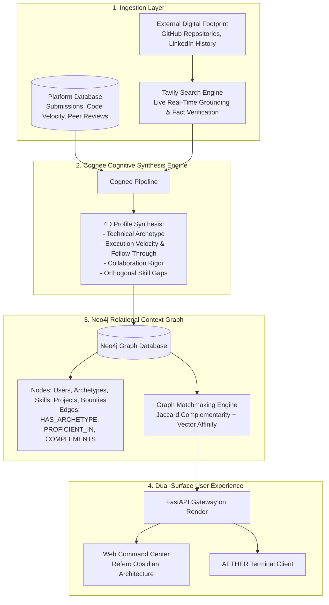

# AETHER: Universal Cognitive Context Layer & Graph Matchmaker

A production-grade context layer sitting above platform user databases that synthesizes raw, fragmented activity logs and external digital footprints into living behavioral profiles, exposed via an interactive Command Center and a high-velocity terminal CLI.

---

## 1. System Architecture



---

## 2. Mathematical Matchmaking Formulation

Traditional matchmaking matches users with identical skills. AETHER computes the **Orthogonal Synergy Index** (\(S\)) to assemble teams with zero redundant overlap and maximum full-stack coverage:

\[
S = \left( \frac{U_{\text{archetypes}}}{N} \times 100 \times 0.35 \right) + \left( \frac{1}{N} \sum_{i=1}^{N} R_i \times 0.35 \right) + \min\left(\sum_{(i,j)} E_{ij}, 30\right)
\]

Where:
- \(N\) is the target squad size.
- \(U_{\text{archetypes}}\) is the count of distinct, non-overlapping technical archetypes in the candidate set.
- \(R_i\) is the execution reliability score of user \(i\), derived from commit velocity, past win rate, and completion follow-through:
  \[
  R_i = (V_{\text{commit}} \times 0.6) + ((1.0 - F_{\text{flake}}) \times 40)
  \]
- \(E_{ij}\) is the bidirectional edge weight between users in the Neo4j relational graph where `(User_i)-[:COMPLEMENTS]->(User_j)`.

---

## 3. Sponsor Technology Integration

| Sponsor | Primary Responsibility | Architectural Implementation |
| :--- | :--- | :--- |
| **Neo4j** | Graph Topology & Matchmaking Engine | Native Cypher queries mapping `User`, `Archetype`, `Skill`, and `Project` nodes. Executes graph traversals for complementary squad formation and multi-hop relationship discovery. |
| **Cognee** | Cognitive Memory & Entity Extraction | Ingests unstructured platform activity, peer reviews, and commit discussions, extracting structured behavioral archetypes into persistent cognitive memory. |
| **Tavily** | Live Real-Time Grounding Sensor | Performs automated external web and code verification on candidates in real time to prevent hallucinated context. |
| **Render** | Production Hosting & Continuous Delivery | Hosts the containerized FastAPI context engine and static assets with live public routing to `shashanktomar.dev`. |

---

## 4. API Specification

### Existence Check
Verify if a given individual exists within the platform database without manual table querying.

```http
GET /api/users/check?q=Shiv
```

**Response**:
```json
{
  "exists": true,
  "query": "Shiv",
  "user": {
    "user_id": "usr_001",
    "username": "shiv_dev",
    "name": "Shiv Sharma",
    "archetype": "High-Velocity Systems Architect",
    "reliability_score": 96.4,
    "commit_velocity": 94,
    "win_rate": 33.3,
    "primary_domain": "Low-Level Systems, Distributed Consensus & Graph Engines"
  },
  "message": "Verified: Shiv Sharma (@shiv_dev) is active in the user base."
}
```

### Conversational Synthesis
Open-ended synthesized narrative queries evaluated over platform-native logs and external footprints.

```http
POST /api/agent/query
Content-Type: application/json

{
  "query": "Is Shiv in our database? What has he built and how active is he?"
}
```

### Graph Matchmaking
Assemble optimal complementary teams with mathematical synergy guarantees.

```http
POST /api/matchmaking/squad
Content-Type: application/json

{
  "target_goal": "High-Velocity AI Systems Project",
  "squad_size": 3
}
```

---

## 5. Command-Line Interface (CLI)

A high-velocity terminal client built for instant developer interaction:

```bash
# Instant existence verification
python cli/aether.py check "Shiv"

# Conversational context synthesis
python cli/aether.py ask "Tell me about Shashank: architecture instincts and velocity"

# Autonomous squad assembly
python cli/aether.py match --size 3 --goal "AI Systems & Web3 Engine"

# List all indexed platform profiles
python cli/aether.py users
```

---

## 6. Verification and Test Suite

All core capabilities are covered by automated integration tests:

```bash
python tests/test_api.py
```

Test coverage:
1. Health check and service metadata
2. User existence check (positive match)
3. User existence check (negative match)
4. Conversational agent existence query
5. Domain-based recommendation synthesis
6. Neo4j graph topology generation
7. Squad matchmaking algorithm execution
8. Downstream opportunity allocation
